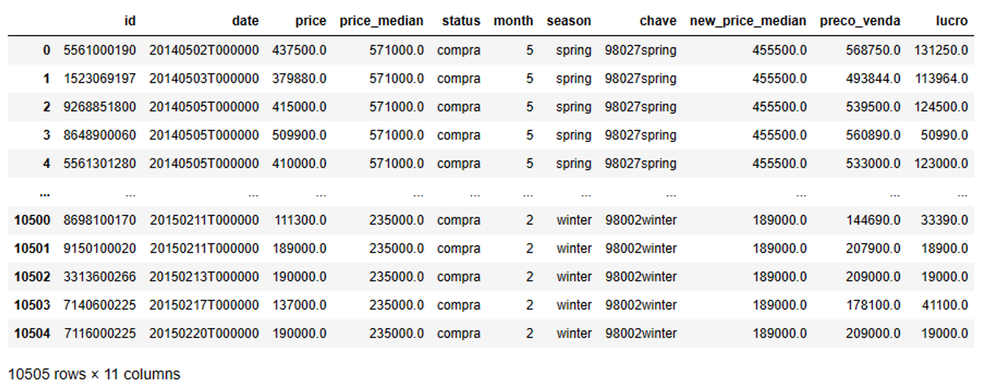

# House Rocket Project
Insights Project
## 1. Business Problem
House Rocket is a ficticional company speacialized in buying and selling houses online. The company acts like a middleman between the seller and a future buyer. The main difference between this type of company and a traditional real state process is that the company actually owns the house before selling to someone else. The company offers a much simpler and faster way to sell a house than traditional real state process, in exchange usually the company offers a price lower than the market value and/or charges a fee to the transaction.

In order to be competitive the company has to buy good houses for a lower price and sell them as soon as possible for the market value. Therefore, the company’s earnings rely on the difference between the selling price and the purchace price, the greater the difference, the greater is the profit.

Since the company is growing as well as its portfolio, the time to analyse the best opportunites has increased significantly. House Rocket has reached out a data science consultancy to built a tool to adress this issue. Thus, the main questions House Rocket want answered quickly bu this new tool are:

  1. *What are the houses the company should buy and for what price?*
  2. *What is the best moment do sell them and for what price?*

## 2. Business Assumptions
- Localization is an important attribute for the purchase price, in this project the zipcode is considered a region in the map with a group of houses.
- The profit is calculated between the selling price and the purchase price as below:
    
    $Profit = Selling Price - Purchase Price$
    
    It is not being taken in consideration any other earnings or costs the company may have.
    
- A good condition is represented by ‘condition’ equal to 3, 4 and 5, while a bad condition is represented by 1 and 2.
- There are four seasons, each one lats three whole months as follow:
    - Spring: March, April, May
    - Summer: June, July, August
    - Fall: September, October, November
    - Winter: December, January, February
- Houses never renovated are the houses in which the value at the column ‘yr_renovated’ is equal to zero.

## 3. Solution Strategy
### 3.1. Final Product
- Report with the houses reccomended and the purchase price (csv file).
- Report with suggestes selling price for each house and when to buy it (csv file).
### 3.2. Tools
- Python
- Pycharm
- Jupyter Notebook
- Heroku
### 3.3. Process
#### 3.3.1. Data Collect:
- Collect data from kaggle and search for error and outliers to remove
#### 3.3.2. Data Exploration:
- Create and test hypothesis to find insights for the business team
#### Solution for Product 01:
- Group dataset by zipcode and calculate the median price.
- The suggestion is to buy all the properties with price less than the region median price.
#### Solution for Product 02:
- Calculated the new median price by zipcode and season —> Each zipcode will have four median prices, for each season.
- Conditions to determine the selling price:
    - Purchase price < new median price —> Selling price = Purchase price + 30%
    - Purchase price > new median price —> Selling price = Purchase price + 10%
    
# 4. Data Collect

- **About the dataset collected from Kaggle: [Link](https://www.kaggle.com/datasets/harlfoxem/housesalesprediction‘)**
    
    This dataset contains house sale prices for King County, which includes Seattle. It includes homes sold between May 2014 and May 2015.
    
- **The dataset has 21 attributes listed below:**

| Item | Description |
| --- | --- |
| id | Unique ID for each home sold |
| date | Date of the home sale |
| price | Price of each home sold |
| bedrooms | Number of bedrooms |
| bathrooms | Number of bathrooms, where .5 accounts for a room with a toilet but no shower |
| sqft_living | Square footage of the apartments interior living space |
| sqft_lot | Square footage of the land space |
| floors | Number of floors |
| waterfront | A dummy variable for whether the apartment was overlooking the waterfront or not |
| view | An index from 0 to 4 of how good the view of the property was |
| condition | An index from 1 to 5 on the condition of the apartment, |
| grade | An index from 1 to 13, where 1 |
| sqft_above | The square footage of the interior housing space that is above ground level |
| sqft_basement | The square footage of the interior housing space that is below ground level |
| yr_built | The year the house was initially built |
| yr_renovated | The year of the house’s last renovation |
| zipcode | What zipcode area the house is in |
| lat | Lattitude |
| long | Longitude |
| sqft_living15 | The square footage of interior housing living space for the nearest 15 neighbors |
| sqft_lot15 | The square footage of the land lots of the nearest 15 neighbors |
- **Data cleanup**
    - All the duplicated id’s were removed, the more recent line was keeped
    - It was not found any outliers after that.
    
## 5. Exploration
The data analysis was driven by a dashboard created in Heroku app. This page is available for the business team pursue their own analysis using personalize filters and creating other insights for the project.

[Access House Rocket Dashboard here](https://house-rocket-project-x54t.onrender.com/)

For the scope of the analysis 10 hypothesis were created and tested:
| Hypothesis | Result | Expected | Real | Action |
| --- | --- | --- | --- | --- |
| 01 - Homes with waterfront are 20% more expensive than homes without waterfront. | False | 20% greater | 206% greater | Adjust |
| 02 - Homes constructed before 1955 are 50% cheaper than homes constructed in 1955 and after. | False | 50% greater | 0.28% greater | Reject |
| 03 - Homes without basement are 40% larger than homes with basement. | False | 40% greater | 22.8% greater | Adjust |
| 04 - The growth of home’s prices YoY (Year of Year) is 10%. | False | 10% | 1.07% | Reject |
| 05 - Homes with 3 bathrooms has a growth MoM (Month over Month) of 15%. | False | 15% | 0.16% | Reject |
| 06 - Homes with more than 1 floor are 40% more expensive than homes with only 1 floor. | False | 40% greater | 17.5% greater | Adjust |
| 07 - Homes renovated in the past 5 years are 20% more expensive than homes who were not. | False | 20% greater | 26.4% greater | Adjust |
| 08 - The growth YoY of home’s prices that were never renovated is 10 units less. | False | 10% less | 12.6% less | Adjust |
| 09 - Homes with condition 3 or less sare 30% cheaper.             | False | 30% cheaper | 38.2% cheaper | Adjust |
| 10 - Homes with a view are 20% more expensive. | False | 20% greater | 73.4% greater | Adjust |

# 6. Top 3 Insights

After adjusting the hypothesys statements in the exploration data three insights

| Insights | Action |
| --- | --- |
| 01 - Homes with waterfront are 20% more expensive than homes without waterfront. | Buy homes with waterfront. |
| 07 - Homes renovated in the past 5 years are 20% more expensive than homes who were not. | Buy homes renovated in the last 5 years. |
| 06 - Homes with more than 1 floor are 40% more expensive than homes with only 1 floor. | Buy homes with more than 1 floors |

# 7. Business Results

It was generated a table containing only the homes recommended to buy together with their selling prices. New columns were created.

[See entire table here in csv](table-selling-prices.csv)

| Total costs on home purchases | Total income from home sales | Total profit |
| --- | --- | --- |
| $ 4,079,586,744.00 | $ 4,832,502,714.60 | $ 752,915,970.60 |

# 8. Conclusion

The solution presented is this project satisfied the company’s requirements. It was observed that having a view or waterfront, good condition, more floors and a recent renovation are characteristics that value real estate. And from the rejected hypothesis is interesting to pointed out that the price growth YoY is only 1.05%, so it is not a good strategy to wait a year or two to sell the house. It is know from the research that the main streategy of the iBuyers is to sell the homes as soon as possible.

# 9. Next Steps

The next steep would be to calculate when is more profitable to sell the house. The project could be used as baseline comparison to a machine leaning model. Gather more business information about how homes are precify in these kind of company and take their insights from the dashboard created in session 5.

# 10. References

[https://www.kaggle.com/datasets/harlfoxem/housesalesprediction](https://www.kaggle.com/datasets/harlfoxem/housesalesprediction)

[Predicting King County House Prices (slideshare.net)](https://www.slideshare.net/PawanShivhare1/predicting-king-county-house-prices)

[Opendoor, Zillow, and the iBuyer Business Model  — Mike DelPrete - Real Estate Tech Strategist (mikedp.com)](https://www.mikedp.com/opendoor-ibuyer-business-model)

[iBuyer: Unsustainable business model, time to pivot. (linkedin.com)](https://www.linkedin.com/pulse/ibuyer-unsustainable-business-model-time-pivot-susan-joynt?trk=public_profile_article_view)

